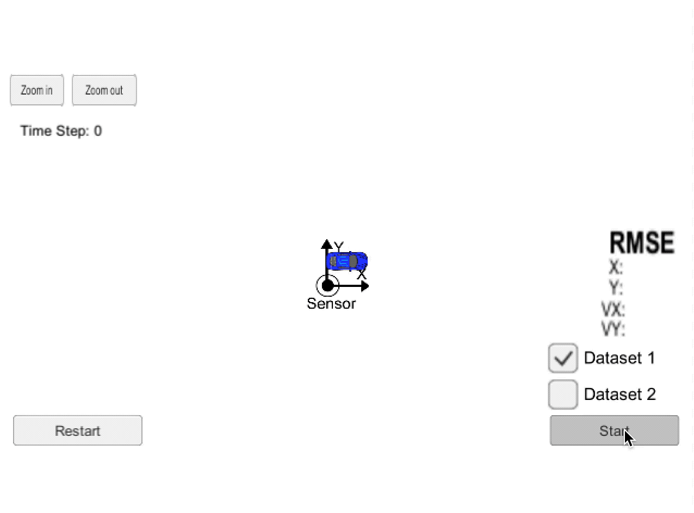

# Extended Kalman Filter Project Starter Code
Self-Driving Car Engineer Nanodegree Program [link](https://www.udacity.com/course/self-driving-car-engineer-nanodegree--nd013)

This project creates an extended kalman filter to estimate the state of a moving object, using readings from a noisy lidar and noisy radar to converge on a state and estimated state. The error is measured using RMSE values that were required to be lower than specified tolerances.

## Running the simulation
This project uses a Udacity simulator which can be downloaded here: [Simulator](https://github.com/udacity/self-driving-car-sim/releases)

To build the project, run:  
1. The .sh script for your computer to set up uWebSocketIo (once)
2. mkdir build
3. cd build
4. cmake ..
5. make
6. ./ExtendedKF
